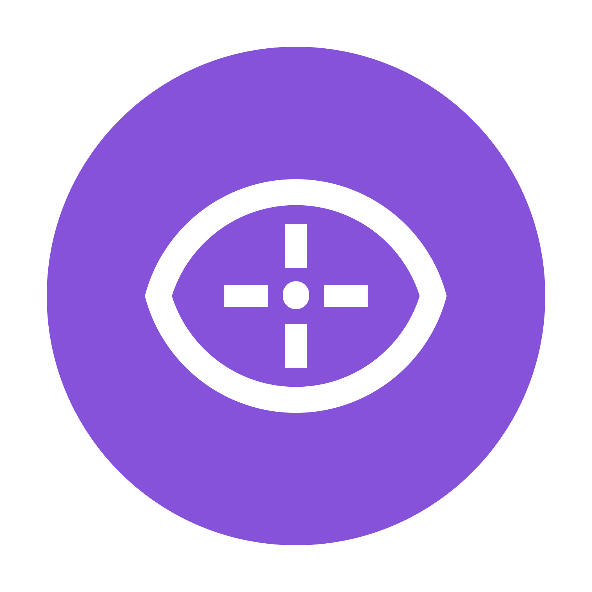

<div id="top"></div>

[![Contributors][contributors-shield]][contributors-url]
[![Forks][forks-shield]][forks-url]
[![Stargazers][stars-shield]][stars-url]
[![Issues][issues-shield]][issues-url]
[![MPL License][license-shield]][license-url]


<!-- PROJECT LOGO -->
<br />
<div align="center">
  <a href="https://waldo.vision">
    
  </a>

  <h3 align="center">WALDO Desktop Application</h3>

  <p align="center">
    This is a desktop application for the WALDO cheat detection software.
    <br />
    <a href="https://docs.waldo.vision"><strong>Explore the docs »</strong></a>
    <br />
    <br />
    ·
    <a href="https://github.com/waldo-vision/waldo.desktop.app/issues">Report Bug</a>
    ·
    <a href="https://github.com/waldo-vision/waldo.desktop.app/issues">Request Feature</a>
    ·
  </p>
</div>


<!-- TABLE OF CONTENTS -->
<details>
  <summary>🗃️Table of Contents</summary>
  <ol>
    <li>
      <a href="#about">📌About</a>
      <ul>
        <li><a href="#built-with">🏗️Built With</a></li>
      </ul>
    </li>
    <li>
      <a href="#getting-started">📚Getting Started</a>
    </li>
    <li><a href="#contributing">💖Contributing</a></li>
    <li><a href="#license">📏License</a></li>
    <li><a href="#contact">📤Contact</a></li>
    <li><a href="#acknowledgments">💗Acknowledgments</a></li>
  </ol>
</details>


<!-- ABOUT THE PROJECT -->
## 📌About

[![WALDO][product-screenshot]](https://waldo.vision)

A deep learning Artificial Intelligence (A.I.) can detect the human behavioral characteristics of a user within a video game. We plan to train an A.I. to understand how humans play video games via a visual machine learning program. Once the program understands how humans play video games based on gameplay footage, we can then feed it the gameplay footage to determine if the player in the footage is receiving assistance from a 3rd party "hack" or "cheat" program.


<p align="right">(<a href="#top">back to top</a>)</p>


### 🏗️Built With

This section should list any major frameworks/libraries used to bootstrap your project. Leave any add-ons/plugins for the acknowledgements section. Here are a few examples.

* [React.js](https://reactjs.org/)
* [electron](https://electronjs.org/)
* [electron-builder](https://www.electron.build/)
* [craco](https://github.com/gsoft-inc/craco)
<p align="right">(<a href="#top">back to top</a>)</p>


<!-- GETTING STARTED -->
## 📚Getting Started

To get started with this project, you will need to read the documentation on how to start [contributing to the project.](https://docs.waldo.vision/docs/App-Docs/contributing-to-electron)


<!-- CONTRIBUTING -->
## 💖Contributing

To contribute to this project, you will need to read the documentation on how to start [contributing to the project.](https://docs.waldo.vision/docs/App-Docs/contributing-to-electron) and read the [global contributing guidelines](https://docs.waldo.vision/docs/contributing). 

### 📐Setup Development Environment

#### 📌Install Dependencies

First you will need to install the dependencies for your project.
We recommend using [yarn](https://yarnpkg.com/) to install all dependencies. 
```
$ yarn install
```
#### ⚙️Begin Development
There are many was to start development with the electron application, you can either start by running the following command:
```bash
$ yarn dev
```
or you can run the following command to start the application in development mode:
```bash
$ yarn dev:react
$ yarn dev:electron
```
#### 🧪Run Tests
To run test or use format your code, you can run the following command:
```bash
$ yarn lint
$ yarn run craco test
```
You will need to create your own test file to run the tests, unless there is a pre-existing test file.
We encourage you to write your own test file to run the tests so that your when you PR your code, you don't need to wait for other developers to run tests on your code.

#### 🏗️Local Building
To build the application for local development, you can run the following command:
```bash
$ yarn build:win
```
This will build the application for windows with two new directories:
`dist` and `build`.
In the `build` directory, you will find the webpack bundle.
You will find the packaged application in the `dist` directory and the unpackaged application in the `dist/win-unpacked` directory.

<p align="right">(<a href="#top">back to top</a>)</p>


<!-- LICENSE -->
## 📏License

Distributed under the MPL License. See `LICENSE.md` for more information.

<p align="right">(<a href="#top">back to top</a>)</p>


<!-- CONTACT -->
## 📤Contact

Twitter: [@waldovision](https://twitter.com/waldovision)

Organisation Link: [https://github.com/waldo-vision](https://github.com/waldo-vision)

<p align="right">(<a href="#top">back to top</a>)</p>


<!-- ACKNOWLEDGMENTS -->
## 💗Acknowledgments
Many thanks to the following projects for the use of their code:
* [electron](https://electronjs.org/)
* [electron-builder](https://www.electron.build/)
* [craco](https://github.com/gsoft-inc/craco)
* [facebook/react](https://reactjs.org/)

<p align="right">(<a href="#top">back to top</a>)</p>


<!-- MARKDOWN LINKS & IMAGES -->
<!-- https://www.markdownguide.org/basic-syntax/#reference-style-links -->
[contributors-shield]: https://img.shields.io/github/contributors/waldo-vision/waldo.desktop.app?color=green&style=for-the-badge
[contributors-url]: https://github.com/waldo-vision/waldo.desktop.app/graphs/contributors
[forks-shield]: https://img.shields.io/github/forks/waldo-vision/waldo.desktop.app?color=bb38fc&label=FORKS&style=for-the-badge
[forks-url]: https://github.com/waldo-vision/waldo.desktop.app/network/members
[stars-shield]: https://img.shields.io/github/stars/waldo-vision?color=%23c76ff2&label=Global%20STARS&style=for-the-badge
[stars-url]: https://github.com/waldo-vision/waldo.desktop.app/stargazers
[issues-shield]: https://img.shields.io/github/issues/waldo-vision/waldo.desktop.app?style=for-the-badge
[issues-url]: https://github.com/waldo-vision/waldo.desktop.app/issues
[license-shield]: https://img.shields.io/github/license/waldo-vision/waldo.desktop.app?style=for-the-badge
[license-url]: https://github.com/waldo-vision/waldo.desktop.app/blob/master/LICENSE.md
[product-screenshot]: screenshot.png
